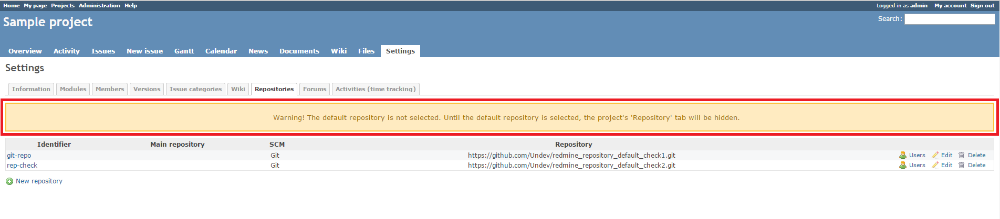
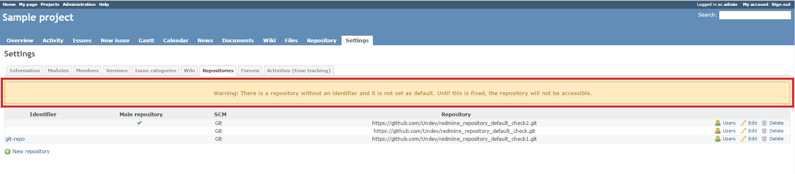

# Redmine Default Repository Check Plugin

This plugin checks if the main repository is set for a Redmine project and other repositories have identifiers.

## Compatibility

This plugin is compatible with Redmine 2.x only.

## Installation

1. To install the plugin
    * Download the .ZIP archive, extract files and copy the plugin directory into *#{REDMINE_ROOT}/plugins*.
    
    Or

    * Change you current directory to your Redmine root directory:  

            cd {REDMINE_ROOT}
 
      Copy the plugin from GitHub using the following command:

            git clone https://github.com/Undev/redmine_repository_default_check.git plugins/redmine_repository_default_check

2. Update the local package index and install the dependencies:

         sudo apt-get update  
         sudo apt-get install libxml2-dev libxslt-dev

3. Update the Gemfile.lock file by running the following commands:  

         rm Gemfile.lock  
         bundle install

4. Restart Redmine.

Now you should be able to see the plugin in **Administration > Plugins**.

## Usage

The plugin checks the repositories listed on the **Repositories** tab of the project settings. If the main repository is not set or some repositories do not have identifiers, the plugin displays the appropriate warnings.

The plugin also warns you if you forget to specify the identifier when you create or edit the repository.

## License

Copyright (c) 2015 Undev

Licensed under the Apache License, Version 2.0 (the "License");
you may not use this file except in compliance with the License.
You may obtain a copy of the License at

http://www.apache.org/licenses/LICENSE-2.0

Unless required by applicable law or agreed to in writing, software
distributed under the License is distributed on an "AS IS" BASIS,
WITHOUT WARRANTIES OR CONDITIONS OF ANY KIND, either express or implied.
See the License for the specific language governing permissions and
limitations under the License.